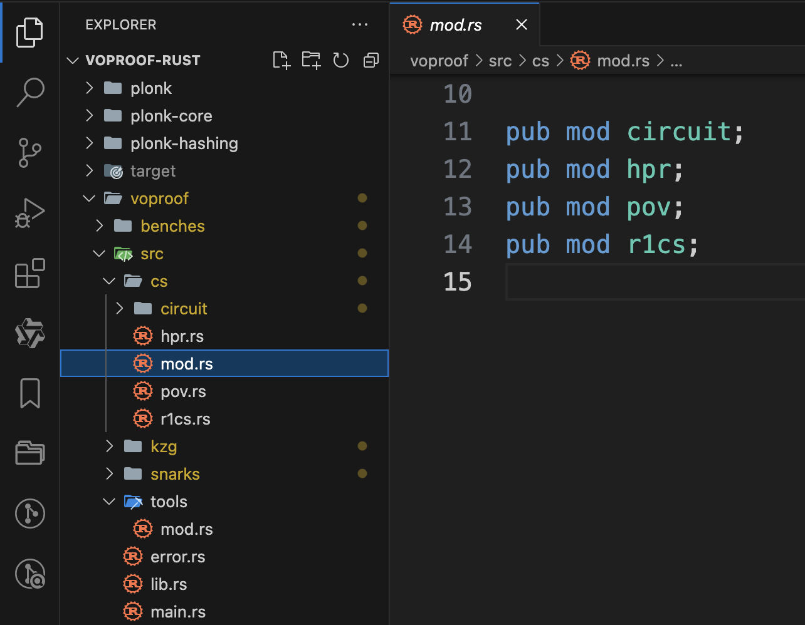
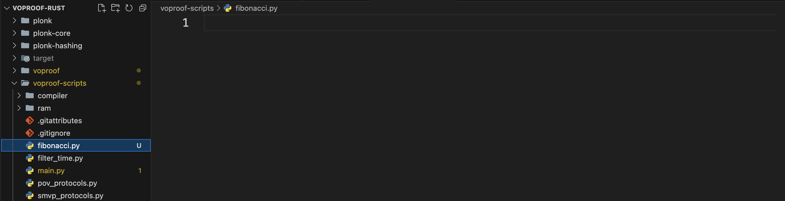
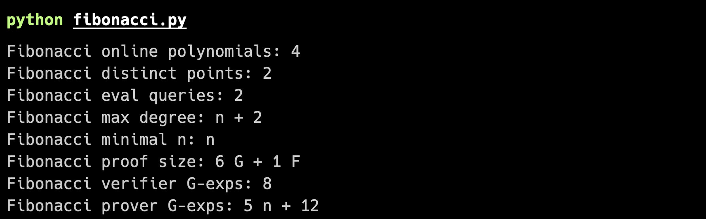
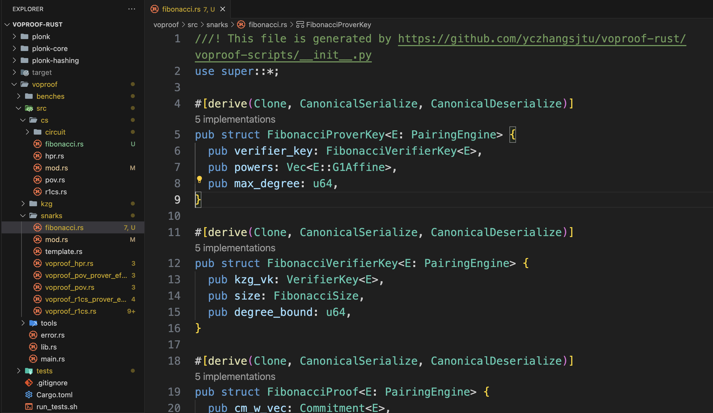

This codebase is the implementation of the paper _[VOProof: Efficient zkSNARKs from Vector Oracle Compilers](https://eprint.iacr.org/2021/710)_. VOProof is a framework for producing SNARKs for NP relations. This codebase has implemented the three SNARKs described in the paper, respective for the three NP relations: R1CS, HPR and PLONK. These relations are popular arithmetizations of the circuit satisfaction problem.

This tutorial explains how to use this codebase to generate code for SNARKs for a given NP relation. For simplicity, we use the Fibonacci sequence as the example.

## Problem Statement

The default Fibonacci sequence can be generated from the following pseudocode:

```
a = 1
b = 1
print a, b
for i from 1 to N
    a, b = b, a + b
	print b
```

However, $a$ and $b$ may take any initial values other than 1. For clarity, we call the initial values of $a$ and $b$ the inputs, and index the values produced in the iteration from 1 to $N$. Denote the value produced in the $i$-th iteration by $\mathsf{Fib}_i(a,b)$. For example, $\mathsf{Fib}_1(a,b)=a+b$.

Note that SNARKs are convenient to build for arithmetic relations, i.e., NP relations involving arithmetic operations over a particular finite field $\mathbb{F}$ that is decided by the concrete SNARK implementation. For most SNARKs, and for our example here, the finite field is a prime field $\mathbb{F}_p$ for a large prime $p$. For convenience, we build the Fibonacci sequence over this finite field $\mathbb{F}$. Therefore, we don't need to worry that the sequence increases exponentially as $N$ grows.

Then we define the following NP relation as the target relation to build SNARK for:
$$\mathcal{R}_N=\left\{((a,b,c),\perp)|\mathsf{Fib}_N(a,b)=c\right\}$$
Here $N$ is the parameter of this relation, $(a,b,c)$ is an instance of this relation, and the witness is empty.

## Arithmetization

The first step of building a SNARK is arithmetization. This step does not have a clear definition. Generally speaking, the goal of this step is to transform the target NP relation into an equivalent NP relation that has a simpler and shallower structure. We call this new NP relation a **Constraint System**. This often involves unrolling the definition of the original NP relation and include the intermediate values into the witness.

In this example, we write down the intermediate values in computing $\mathsf{Fib}_N$ as: $w_1=a+b,w_2=b+w_0$, then for every $i$ from $3$ to $N$, $w_i=w_{i-2}+w_{i-1}$.

We collect all these intermediate values into a vector $\vec{w}$. Now it is obvious that the following NP language contains the same instances as the original NP language:
$$\mathcal{R}_N=\left\{((a,b,c),\vec{w}\in\mathbb{F}^N)\left|\begin{array}{l}\vec{w}[1]=a+b,\vec{w}[2]=a+2b,\vec{w}[N]=c\\\vec{w}[i]=\vec{w}[i-1]+\vec{w}[i-2]\quad\forall 2< i\leq N\end{array}\right.\right\}$$
This relation is shallower than the original relation in the sense that the condition now becomes a collection of simple equations which can be described by shallow circuits.

Let's define this relation using code.

First, go to the following file in the codebase, and add a new module `fibonacci` by adding a new line `pub mod fibonacci`, and create a new file `fibonacci.rs` in this folder.



Put the following code into this new file.

```rust
use std::marker::PhantomData;

use super::*;

#[derive(Clone, CanonicalSerialize, CanonicalDeserialize)]
pub struct Fibonacci<F: Field> {
  pub n: usize,
  _phantom: PhantomData<F>,
}

impl<F: Field> Fibonacci<F> {
  pub fn new(n: usize) -> Self {
    Fibonacci {
      n,
      _phantom: PhantomData,
    }
  }
}

#[derive(Clone, CanonicalSerialize, CanonicalDeserialize)]
pub struct FibonacciSize {
  pub n: usize,
}

impl CSSize for FibonacciSize {}

impl<F: Field> ConstraintSystem<F, FibonacciSize> for Fibonacci<F> {
  fn get_size(&self) -> FibonacciSize {
    FibonacciSize { n: self.n }
  }
}

#[derive(Clone)]
pub struct FibonacciInstance<F: Field> {
  pub a: F,
  pub b: F,
  pub c: F,
}

#[derive(Clone)]
pub struct FibonacciWitness<F: Field> {
  pub w: Vec<F>,
}

impl<F: Field> Instance<F> for FibonacciInstance<F> {}
impl<F: Field> Witness<F> for FibonacciWitness<F> {}
```

In this file we define four structures: `Fibonacci`, `FibonacciSize`, `FibonacciInstance` and `FibonacciWitness`. They respectively implement the four traits: `ConstraintSystem`, `CSSize`, `Instance` and `Witness`. Note that most of these traits are just markers and do not require implementing any methods. The `ConstraintSystem` trait requires implementing the `get_size` method which returns a `FibonacciSize` structure.

In this simple example, the only parameter about this relation is the size $N$, so both `Fibonacci` and `FibonacciSize` have just one field storing $N$. However, for more complex relations, the size structure (i.e., `FibonacciSize`) may store more integers (e.g., width and height of a matrix), and the constraint system structure (i.e., `Fibonacci`) should store all the parameters that determine the relation.

## VO Protocol

Next, we design a VO protocol for this constraint system. A VO protocol is an interactive protocol where both parties have access to an oracle called the **Vector Oracle (VO)**. The oracle is parameterized by a size $N$ and accepts the following queries:
- The prover may submit arbitrary vectors of size $N$ to VO.
- The verifier may also submit vectors to VO, but restricted to the following special vectors:
	- Sparse vectors.
	- Power vectors, i.e., vectors of the form $(a,a^2,\cdots,a^m)$, where $m\leq N$. Particularly, the verifier may submit the all-one vector ($a=1$) and the all-zero vector $(a=0)$.
- The verifier may apply the following operations to the vectors already submitted:
	- Addition.
	- Multiplication by a scalar.
	- Right shift. The shift is zero-prefixed, i.e., after shifting by $k$ positions, the vector is prefixed by $k$ zeros, and the rightmost $k$ elements are removed.
- The verifier may ask the following relations about the vectors already submitted:
	- Hadamard relation: $\vec{a}\circ\vec{b}=\vec{c}\circ\vec{d}$.
	- Inner Product relation: $\vec{a}\cdot\vec{b}=\vec{c}\cdot\vec{d}$.

The VO protocol will be compiled into a SNARK. It is ensured that in the final SNARK, all the vectors submitted by the prover in the VO protocol will be hidden from the verifier, so in the design of the VO protocol, the prover can safely submit secret vectors to VO.

Therefore, in our simple example, the first step can simply be: the prover submits the witness vector $\vec{w}$ to VO.

It remains for the verifier to check that $\vec{w}$ satisfies all the requirements as in the definition of this constraint system:

1. $\vec{w}[1]=a+b$
2. $\vec{w}[2]=a+2b$
3. $\vec{w}[N]=c$
4. $\vec{w}[i]=\vec{w}[i-1]+\vec{w}[i-2]$ for $i$ from $3$ to $N$

The first three conditions can be accomplished via a single Hadamard query.
$$
\vec{w}\circ(1,1,0,\cdots,0,1)=(a+b,a+2b,0,\cdots,0,c)\circ(1,1,\cdots,1)
$$
Note that, except $\vec{w}$, all the other vectors involved in this query can be submitted by the verifier, as they are either sparse or all-one.

For the last condition, we need to use the vector shifting operation. Note that it is equivalent to the following query:
$$(\vec{w}^{\to 1}+\vec{w}^{\to 2}-\vec{w})\circ(0,0,1,\cdots,1)=(0,\cdots,0)\circ(0,\cdots,0)$$
The "$\to k$" on the superscript means the vector is right shifted by $k$ positions. The second vector here contains two zeros followed by $N-2$ ones.

Now the protocol is finished. Note that the VO protocol is very simple: the prover submits one vector, and the verifier applies two Hadamard queries to check that this vector satisfies certain relations.

Let's describe this protocol by code.

In the `voproof-scripts` folder, create a new file `fibonacci.py`.



Create an empty VO protocol named `Fibonacci` with the following code:

```python
from compiler.vo_protocol import VOProtocol

class Fibonacci(VOProtocol):
    def __init__(self):
        super(Fibonacci, self).__init__("Fibonacci")
        
    def preprocess(self, voexec):
        return {}
        
    def execute(self, voexec, pp_info):
        pass
```

Here the parameter `voexec` in the `execute` method provides the methods for describing the VO protocol, and `pp_info` is used for passing data from preprocessing protocol. We can ignore `pp_info` for now as the current protocol doesn't need preprocessing.

Next, let's fill in the protocol. The final class definition looks like this (with the necessary imports).

```python
from sympy import Symbol
from compiler.vo_protocol import VOProtocol, VOProtocolExecution
from compiler.symbol.vector import get_named_vector, PowerVector, UnitVector
from compiler.symbol.names import get_name
from compiler.builder.rust import rust

class Fibonacci(VOProtocol):
    def __init__(self):
        super(Fibonacci, self).__init__("Fibonacci")
    
    def preprocess(self, voexec):
        return {}
    
    def execute(self, voexec: VOProtocolExecution, pp_info, n):
        voexec.verifier_rust_init_size(n, "n")

        a, b, c, a_plus_2b = Symbol(get_name("a")), Symbol(get_name("b")), Symbol(get_name("c")), Symbol(get_name("aplus2b"))
        voexec.verifier_rust_define(a, "x.a")
        voexec.verifier_rust_define(b, "x.b")
        voexec.verifier_rust_define(c, "x.c")
        voexec.verifier_rust_define(a_plus_2b, rust(a + 2 * b, to_field=True))

        w = get_named_vector("w")
        voexec.prover_rust_define_vec(w, "w.witness.clone()")
        voexec.prover_submit_vector(w, n)

        voexec.hadamard_query(
            w,
            UnitVector(1) + UnitVector(2) + UnitVector(n),
            UnitVector(1) * (a + b) + UnitVector(2) * a_plus_2b + UnitVector(n) * c,
            PowerVector(1, n),
        )
        voexec.hadamard_query(
            w.shift(1) + w.shift(2) - w,
            PowerVector(1, n) - UnitVector(1) - UnitVector(2)
```

Note that the `sympy` library is required and can be installed with `pip install sympy`.

First, we get the attribute `n` in the `FibonacciSize` structure and assign it to the symbol `n`. Remember that this symbol represents a value of integer type, so it can only be used in places where an integer is expected, e.g., vector index, vector size.

Next, we create several symbols to represent the values $a,b,c$. We wrap the symbol names with the `get_name` method to obtain strings without possible name conflicts, since the compiler or subprotocols may internally use the same names. We use the `verifier_rust_define` method to directly insert rust code to the compiler. This method will generate a line `define!(a, x.a)` to the compiled rust code in both prover and verifier (because all the behaviors of verifier is also executed by the prover). This line is a simple wrapper around `let a = x.a`. Here `x` is the instance passed to the prover or the verifier function.

Note that we also introduce a symbol `a_plus_2b` to store the value of $a+2b$. This is because of a caveat in the current compiler. Currently, it is not smart enough to automatically transform the expression `a + 2 * b` into rust code `a + to_field(2) * b`, if not instructed explicitly. The code `a + 2 * b` will cause compilation error because a field element cannot be directly multiplied with an integer.

Next, create a symbol `w` that represents a vector. We use the `prover_rust_define_vec` method to instruct the prover to compute this vector. In this case, `w` is simply a clone of the `witness` attribute in the `FibonacciWitness` structure. This computation only happens on the prover side.

After submitting the vector `w`, the verifier makes two queries. The sparse vectors and power vectors are created using `UnitVector` and `PowerVector`. Note that the vector positions are counted starting from 1. Also note that for the second Hadamard query we only pass two vectors as parameters, which is a shorthand for the case when the right hand side of the equation is zero.

## Compile to SNARK

After the protocol is finished, append the following code for executing the compiler.

```python
if __name__ == "__main__":
    symbols = generate_size_symbols(n = "n")
    n = symbols["n"]
    compile(Fibonacci().with_preprocess_args().with_execute_args(n),
            symbols, "fibonacci")
```

In the command line, go to the `voproof-scripts` directory, and execute the command `python fibonacci.py`. The compiler outputs something like this.



Now we can see there is a new file `fibonacci.rs` created in the `voproof/src/snarks` directory.




Go to the `voproof/src/snarks/mod.rs` file, and append the following code

```rust
pub mod fibonacci;
use crate::cs::{
	fibonacci::{Fibonacci, FibonacciInstance, FibonacciSize, FibonacciWitness}
};
```

Now the code for the SNARK for Fibonacci has been generated. It remains to invoke these code. Here is an example function for testing the code.

```rust
fn run_fibonacci_example<E: PairingEngine>(n: usize) -> Result<(), Error> {
  let a = to_field::<E::ScalarField>(1);
  let b = a.clone();
  let mut w = vec![a, b];
  for _ in 0..n {
    w.push(w[w.len() - 2].clone() + w[w.len() - 1].clone());
    println!("{:?}", w.last().unwrap());
  }
  let c = *w.last().unwrap();

  let x = FibonacciInstance { a, b, c };
  let size = FibonacciSize { n };
  let w = FibonacciWitness {
    witness: w[2..].to_vec(),
  };
  println!("{:?}", w.witness);
  let cs = Fibonacci::<E::ScalarField>::new(n);
  let pp: UniversalParams<E> = VOProofFibonacci::setup(VOProofFibonacci::get_max_degree(size))?;
  let (pk, vk) = VOProofFibonacci::index(&pp, &cs)?;
  let proof = VOProofFibonacci::prove(&pk, &x, &w)?;
  VOProofFibonacci::verify(&vk, &x, &proof)
}
```

## Add Preprocessing

To show an example where the preprocessing is needed, we extend the definition of Fibonacci relation to include another vector $\vec{t}$ of size $N$, and redefine the generalized Fibonacci sequence as follows.

```
a = 1
b = 1
print a, b
for i from 1 to N
    a, b = b, a + b * t[i]
	print b
```

We redefine the relation to include $\vec{t}$ in its _index_. Now this relation becomes an indexed relation.
$$\mathcal{R}_N=\left\{(\vec{t},(a,b,c),\perp)|\mathsf{Fib}_{N,\vec{t}}(a,b)=c\right\}$$
Similarly, we can arithmetize this extended relation as
$$\mathcal{R}_N=\left\{(\vec{t},(a,b,c),\vec{w}\in\mathbb{F}^N)\left|\begin{array}{l}\vec{w}[1]=a+b\cdot\vec{t}[1],\vec{w}[2]=b+\vec{w}[1]\cdot\vec{t}[2],\vec{w}[N]=c\\\vec{w}[i]=\vec{w}[i-1]+\vec{w}[i-2]\cdot\vec{t}[i]\quad\forall 2< i\leq N\end{array}\right.\right\}$$

The constraint system is updated as follows.

```rust
use super::*;

#[derive(Clone, CanonicalSerialize, CanonicalDeserialize)]
pub struct Fibonacci<F: Field> {
  pub n: usize,
  pub t: Vec<F>,
}

impl<F: Field> Fibonacci<F> {
  pub fn new(n: usize, t: Vec<F>) -> Self {
    Fibonacci { n, t }
  }
}

#[derive(Clone, CanonicalSerialize, CanonicalDeserialize)]
pub struct FibonacciSize {
  pub n: usize,
}

impl CSSize for FibonacciSize {}

impl<F: Field> ConstraintSystem<F, FibonacciSize> for Fibonacci<F> {
  fn get_size(&self) -> FibonacciSize {
    FibonacciSize { n: self.n }
  }
}

#[derive(Clone)]
pub struct FibonacciInstance<F: Field> {
  pub a: F,
  pub b: F,
  pub c: F,
}

#[derive(Clone)]
pub struct FibonacciWitness<F: Field> {
  pub witness: Vec<F>,
}

impl<F: Field> Instance<F> for FibonacciInstance<F> {}
impl<F: Field> Witness<F> for FibonacciWitness<F> {}

```

The VO protocol is updated as follows:
1. In the offline stage, the preprocessor submits $\vec{t}$
2. In the online stage, the prover submits $\vec{w}$, $\vec{r}=\vec{w}^{\to 1}\circ\vec{t}$
3. The verifier checks $(\vec{w}-a\cdot \vec{e}_1-b\cdot\vec{t})\circ\vec{e}_1=\vec{0}$, where $\vec{e}_1$ is the unit vector at position $1$, and $\vec{e}_N$ is the unit vector at position $N$.
4. The verifier checks $\vec{r}\circ\vec{1}=\vec{w}^{\to 1}\circ\vec{t}$ where $\vec{1}$ is the all-one vector of length $N$
5. The verifier checks $(\vec{w}-b\cdot\vec{e}_2-\vec{r})\circ\vec{e}_2=\vec{0}$
6. The verifier checks $(\vec{w}-c\cdot\vec{e}_N)\circ\vec{e}_N=\vec{0}$
7. The verifier checks $(\vec{w}-\vec{w}^{\to 2}-\vec{r})\circ(\vec{1}-\vec{e}_1-\vec{e}_2)=\vec{0}$

The file `fibonacci.py` is updated as follows:

```rust
from sympy import Symbol
from compiler import compile, generate_size_symbols, set_debug_mode
from compiler.vo_protocol import VOProtocol, VOProtocolExecution
from compiler.symbol.vector import get_named_vector, PowerVector, UnitVector
from compiler.symbol.names import get_name
from compiler.builder.rust import rust

class Fibonacci(VOProtocol):
    def __init__(self):
        super(Fibonacci, self).__init__("Fibonacci")
    
    def preprocess(self, voexec: VOProtocolExecution, n):
        voexec.pp_rust_init_size(n, "n")

        t = get_named_vector("t")
        voexec.pp_rust_define_vec(t, "cs.t.clone()")
        voexec.preprocess_vector(t, n)

        return {
            "t": t
        }
    
    def execute(self, voexec: VOProtocolExecution, pp_info, n):
        t = pp_info["t"]
        voexec.verifier_rust_init_size(n, "n")

        a, b, c = Symbol(get_name("a")), Symbol(get_name("b")), Symbol(get_name("c"))
        voexec.verifier_rust_define(a, "x.a")
        voexec.verifier_rust_define(b, "x.b")
        voexec.verifier_rust_define(c, "x.c")

        w = get_named_vector("w")
        voexec.prover_rust_define_vec(w, "w.witness.clone()")
        voexec.prover_submit_vector(w, n)

        r = get_named_vector("r")
        voexec.prover_rust_define_vec(r,
f"""
[zero!()].iter()
         .chain({rust(w)}.iter())
         .take({n} as usize)
         .zip(pk.{rust(t)}.iter())
         .map(|(&a,&b)|a*b)
         .collect::<Vec<_>>()
""")
        voexec.prover_submit_vector(r, n)

        voexec.hadamard_query(
            w - a * UnitVector(1) - b * t,
            UnitVector(1)
        )
        voexec.hadamard_query(
            r,
            PowerVector(1, n),
            w.shift(1),
            t
        )
        voexec.hadamard_query(
            w - b * UnitVector(2) - r,
            UnitVector(2)
        )
        voexec.hadamard_query(
            w - c * UnitVector(n),
            UnitVector(n)
        )
        voexec.hadamard_query(
            w - w.shift(2) - r,
            PowerVector(1, n) - UnitVector(1) - UnitVector(2)
        )

if __name__ == "__main__":
    symbols = generate_size_symbols(n = "n")
    n = symbols["n"]
    compile(Fibonacci().with_preprocess_args(n).with_execute_args(n),
            symbols, "fibonacci")
```

Note that in the `preprocess` function,  we use the `pp_rust_define_vec` method to tell the preprocessor how to compute the value of the vector $\vec{t}$, in this case simply clone from the constraint system `cs`. We pass this vector from the `preprocess` function to the `execute` function by `pp_info`. We then update the `execute` function according to our new VO protocol, where the code for computing vectors $\vec{r}$ is handwritten.

The example code is updated accordingly.

```rust
fn run_fibonacci_example<E: PairingEngine>(n: usize) -> Result<(), Error> {
  let a = to_field::<E::ScalarField>(1);
  let b = a.clone();
  let mut w = vec![a, b];
  for _ in 0..n {
    w.push(w[w.len() - 2].clone() + w[w.len() - 1].clone());
    println!("{:?}", w.last().unwrap());
  }
  let c = *w.last().unwrap();

  let x = FibonacciInstance { a, b, c };
  let size = FibonacciSize { n };
  let w = FibonacciWitness {
    witness: w[2..].to_vec(),
  };
  println!("{:?}", w.witness);
  let cs = Fibonacci::<E::ScalarField>::new(n, vec![one!(); n]);
  let pp: UniversalParams<E> = VOProofFibonacci::setup(VOProofFibonacci::get_max_degree(size))?;
  let (pk, vk) = VOProofFibonacci::index(&pp, &cs)?;
  let proof = VOProofFibonacci::prove(&pk, &x, &w)?;
  VOProofFibonacci::verify(&vk, &x, &proof)
}
```

